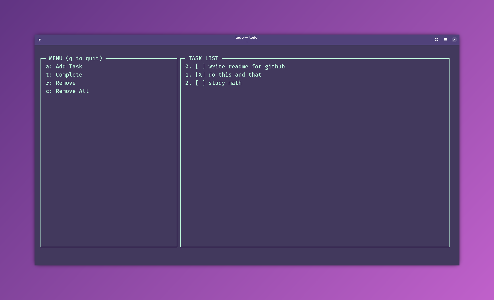

# nc-do (ncurses do)
nc-do is a lightweight, quick, ncurses-based todo app.

<p align="center">
	
</p>

## Features
- Auto saving/loading via JSON
- XDG Base Directory Support
- Dynamic TUI

## Running
Downlaod the latest executable from releases and optionally add to your PATH.

## Building
```bash
git clone https://github.com/terra2o/nc-do.git
g++ -std=c++17 -o ncdo main.cpp -lncurses
```

## Why this exists
I love messing around with ncurses. I thought being able to quickly take notes via the terminal would be efficient for my workflow.

## TODO
- Implement scrolling. (Don't make too many tasks!)
